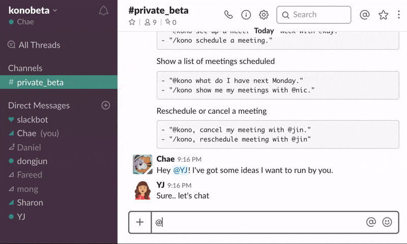

# 👨‍💻 COK_MENTORING<SW개발>

## 🙏  *Supporter ~~(Mentor)~~*
- 이름 : 박승현  
- 소속 : IT디지털정보단 IT마케팅개발팀  
- 업무 : 신용실적 & 마켓Me-In

## 🖥 *Why*    
- 단순한 IT지식 습득을 위한 개발공부가 아닌, <h3>TOY Project</h3> 수행을 통해 IT지식 및 실무 역량 증진 목적

## 🖱 *What*
- **WEB/APP/GAME** 등 SW 개발 진행  
- 예시로 아래와 같은 개발 영역을 구상 중이며, 구성원들간 상의 후 결정 예정

|개발 영역|연관 언어(FrameWork)|
|:---------:|:---------:|
|WEB| |  
|APP| |
|Game||

## 🕹 *How* 
- Communication
  * On/Off-Line 구분 없이 진행(Off-Line보다는 On-Line 지향)  
  * Google Docs, Slack 및 Trello 등을 활용하여 프로젝트를 진행(추후 변경 가능)  
   - WhiteBoard 보단 Trello를  
        
   - 한글/MS office보단 Google Docs를  
      
   - KakaoTalk 보단 Slack을 활용할 예정입니다.  
      
      
- Development  
  * 구성원끼리 개발 내용 합의 후 프로젝트 주제 선정  
  * 프로젝트 수행에 필요한 지식 습득  
  * 프로젝트 수행 (Git 등 여러 SVN 시스템 활용 협업 진행)  
  * 결과물의 상태에 따라 Release 예정  
   
- Style  
  * 멘토, 멘티의 관계가 아닌 하나의 팀 혹은 개인 단위 프로젝트를 통해 진행할 예정  
  * (저보다 잘하시는 분들이 많을거라 생각합니다...)
  * **따라서 IT지식에 대해 Top-down방식(주입식)으로 지도하지 않을 예정**  
    **다만 트러블슈팅 처리에 대한 협업, 서적 및 영상강의 등 자료 제공 가능👌🏻**  

## 📆 *Schedule*  
- 8월 : ICE_BREAKING🧊🔨 및 주제 선정  
- 9월 : Git 연습 / 개발 관련 배경지식 습득  
- 10월 ~ 12월 초 : TOY Project 진행 및 가능하면 Release